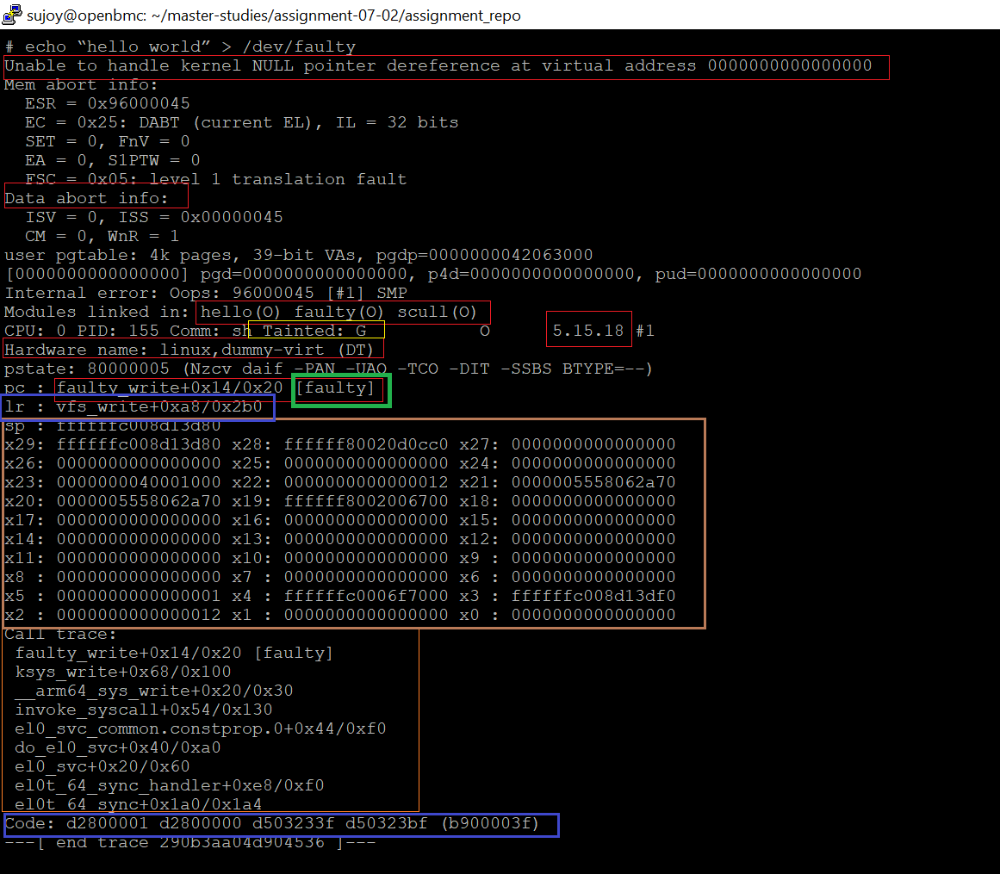
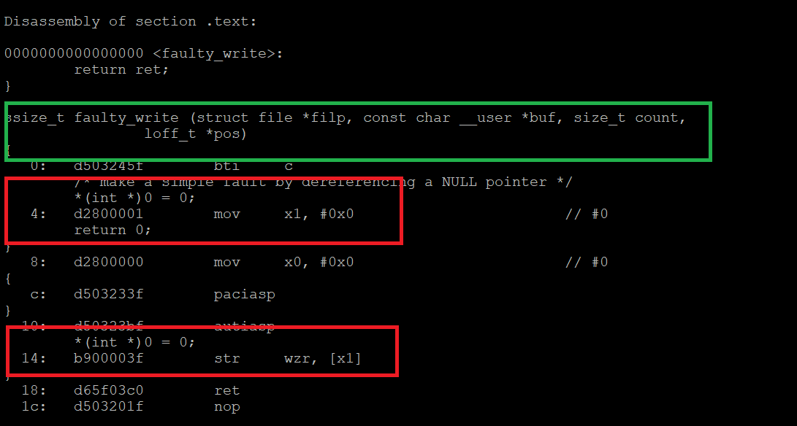
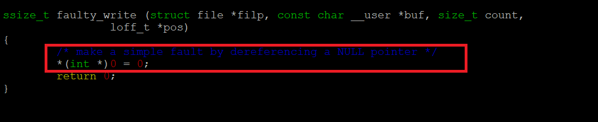

# OOPs message analysis

The purpose of the document is to analyze the OOPs message generated as a result
of issuing the commmand <br> **echo “hello_world” > /dev/faulty** in QEMU seesion for the assignment
7-(2).
Below is the screen dump of the OOPs message. In the first section, an analysis of the OPPs message
would be provided. In the second section, the analysis of the offending code will be provided.



## Analysis of the OOPs message

The executive summary of the crash is: <br>
1) **Unable to handle kernel NULL pointer dereference at virtual address 0000000000000000**
2) The location that cuased the crash is : <br>
    **pc : faulty_write+0x14/0x20** <br>
    Here pc = program counter <br>

In addition to above, the OPPs message provides very many other important information, which
can be very useful. 

1) **CPU State :**  CPU is in abort state and below are the description of various registers. <br>
                     One can refer to CPU user's manual to decode the content of the register. <br>
```c
        Mem abort info: <br>
          ESR = 0x96000045 <br>
          EC = 0x25: DABT (current EL), IL = 32 bits <br>
          SET = 0, FnV = 0 <br>
          EA = 0, S1PTW = 0 <br>
          FSC = 0x05: level 1 translation fault <br>
        Data abort info:<br>
          ISV = 0, ISS = 0x00000045<br>
          CM = 0, WnR = 1<br>
```
 2) **CPU State - GPR info:** The general purpose register info can be useful in debugging the crash. <br>
                              The location of the crash is pointed by Program Counter (PC) that states: <br>
                              **faulty_write+0x14/0x20 [faulty]** <br>
                              The name of the function is faulty_write and it is part of the *faulty* module.
                              It also states the offeset from the function.
                              
```c
        pc : faulty_write+0x14/0x20 [faulty]
        lr : vfs_write+0xa8/0x2b0
        sp : ffffffc008d13d80
        x29: ffffffc008d13d80 x28: ffffff80020d0cc0 x27: 0000000000000000
        x26: 0000000000000000 x25: 0000000000000000 x24: 0000000000000000
        x23: 0000000040001000 x22: 0000000000000012 x21: 0000005558062a70
        x20: 0000005558062a70 x19: ffffff8002006700 x18: 0000000000000000
        x17: 0000000000000000 x16: 0000000000000000 x15: 0000000000000000
        x14: 0000000000000000 x13: 0000000000000000 x12: 0000000000000000
        x11: 0000000000000000 x10: 0000000000000000 x9 : 0000000000000000
        x8 : 0000000000000000 x7 : 0000000000000000 x6 : 0000000000000000
        x5 : 0000000000000001 x4 : ffffffc0006f7000 x3 : ffffffc008d13df0
        x2 : 0000000000000012 x1 : 0000000000000000 x0 : 0000000000000000
```
<br>

3) **Modules:** The system has following modules linked in. <br>
```c
        Modules linked in: hello(O) faulty(O) scull(O)
```
<br>
 
4) **Hardware information:** The system is running on the following hardwware.

```c
        Hardware name: linux,dummy-virt (DT)
```
<br>

5) **Kernel information :** The linux kernel version is **5.15.18** and it is a tainted kernel.

6) **System call trace:** This section provides the detailed call-tree up to the point of the crash. This can be
                          very useful information for tracing the code. 
                          

```c
        Call trace:
         faulty_write+0x14/0x20 [faulty]
         ksys_write+0x68/0x100
         __arm64_sys_write+0x20/0x30
         invoke_syscall+0x54/0x130
         el0_svc_common.constprop.0+0x44/0xf0
         do_el0_svc+0x40/0xa0
         el0_svc+0x20/0x60
         el0t_64_sync_handler+0xe8/0xf0
         el0t_64_sync+0x1a0/0x1a4
```
<br>

7) **Code** :  This section is the hex-dump of the code which ran and caused the OOPs.
```c
        d2800001 d2800000 d503233f d50323bf (b900003f)
```
<br>


## Analysis of the code that caused the OOPs

Below is the screenshot of the objdump of faulty module. 



The offeset 14, the store instruction caused the crash when a null pointer is dereferenced.

The x1 register was loaded with 0 in the line 4.
The x1 register was used as a pointer of the store instruction used in line 14. 
This caused the problem.

Below is the actual C code that caused the issue.

